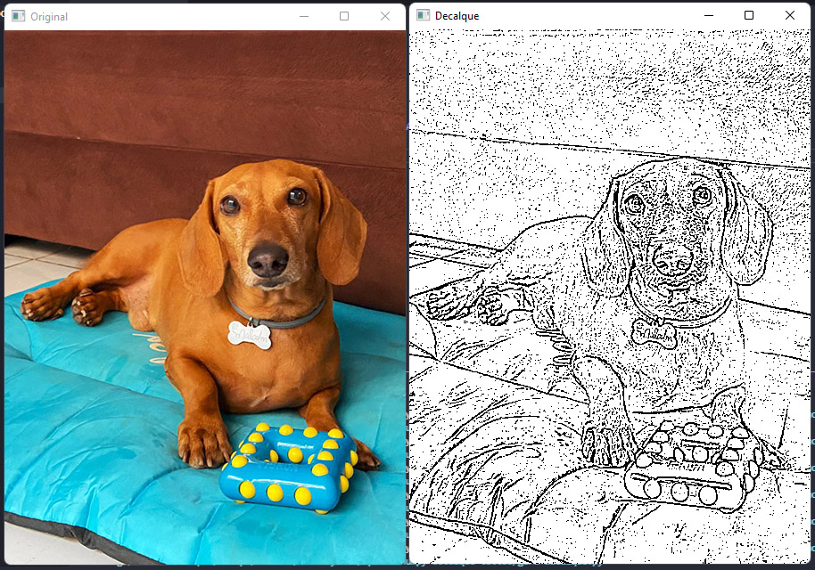

# Gerador de Decalque

Uma das técnicas dos tatuadores de criar o decalque de uma imagem para transferir para a pele de seus clientes, de forma resumida é justamente mudar a imagem para tons de cinza, utilizar um desfoque e configurar os detalhes que gostaria de usar.

E é isso que faremos com esse pequeno código com **OpenCv** e **NumPy**, onde usei como exemplos a foto de minha gata e a do Malcom (<a href="https://instagram.com/malcomsalsicha">@malcomsalsicha</a>).

## Adaptações

Para alterar a visualização do resultado final com mais ou menos detalhes você pode realizar ajustes em dois lugares no código, o primeiro, seria no desfoque, alterando o segundo parâmetro do mediumBlur para outro maior:

~~~~python
gray = cv2.medianBlur(gray, 1)
~~~~

Outro ponto que pode ser alterado são os parâmetros setados como "5, 5" para menos ou mais:

~~~~python
decalque = cv2.adaptiveThreshold(gray, 255, cv2.ADAPTIVE_THRESH_MEAN_C, cv2.THRESH_BINARY, 5, 5)
~~~~

Brinque com as edições e veja a melhor forma para você.